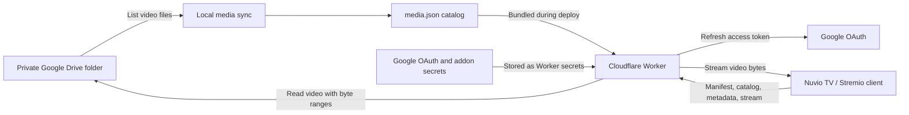

# DriveMio

DriveMio is a personal Stremio addon for streaming private Google Drive videos on Stremio-compatible clients such as Nuvio TV. A Cloudflare Worker serves the addon catalog and streams video from Drive with signed URLs and byte-range support. Media metadata is generated locally from a Drive folder; your Google credentials and generated catalog stay out of the source repository.

The project is designed for a single owner and does not provide multi-user accounts or video transcoding.

## Architecture

The generated catalog and local configuration stay outside Git. The Worker serves metadata from the deployed catalog and reads video bytes from Drive when a client plays or seeks. It does not store or transcode video.

## How it works

1. Upload videos to a private Drive folder. Run `make generate-media` to create a local catalog, then `make deploy` to publish the catalog and Worker code. New files appear only after this step is repeated.
2. Install the private manifest URL in Nuvio. The Worker uses the addon token in that URL to serve the catalog, metadata, and stream information.
3. When you select a video, the Worker returns a short-lived signed video URL. Nuvio requests that URL, including byte ranges when it starts playback or seeks.
4. The Worker exchanges its Google refresh token for an access token, fetches the requested bytes from Drive, and streams them to Nuvio. Your Google credentials stay in the Worker.

## Documentation

- [English guide](docs/en/README.md)
- [Vietnamese guide](docs/vi/README.md)

Both guides explain the example settings, walk through Google Drive and Cloudflare setup, and list every `make` command.

## Screenshots

