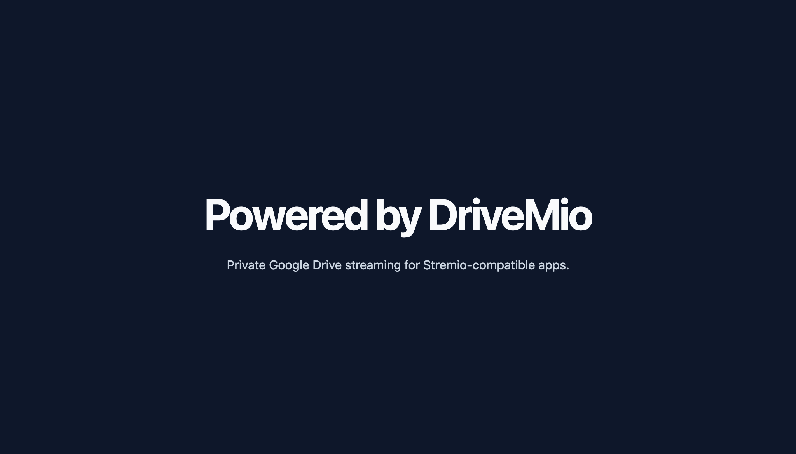
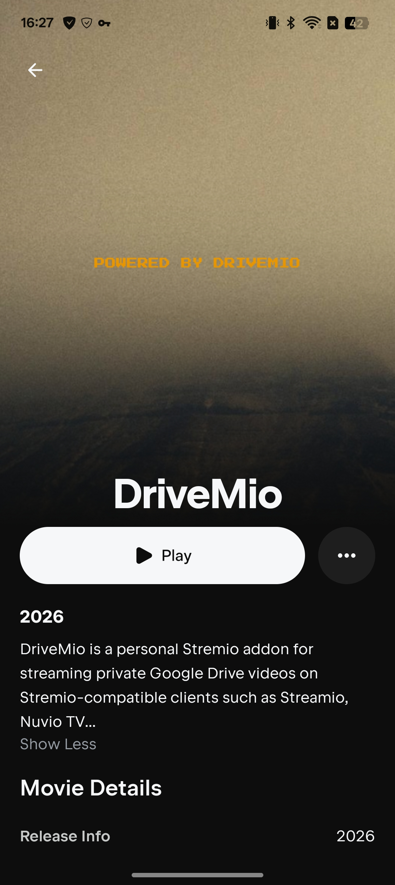
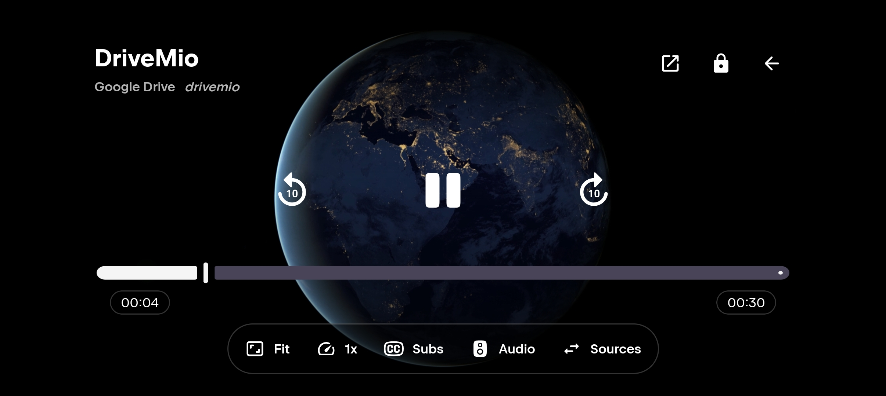
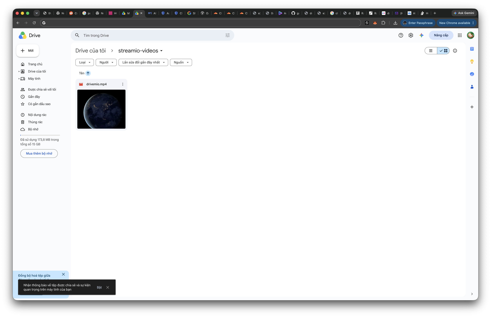

# DriveMio

DriveMio is a personal Stremio addon for streaming private Google Drive videos on Stremio-compatible clients such as Nuvio TV. A Cloudflare Worker serves the addon catalog and streams video from Drive with signed URLs and byte-range support. Media metadata is generated locally from a Drive folder; your Google credentials and generated catalog stay out of the source repository.

The project is designed for a single owner and does not provide multi-user accounts or video transcoding.

## Documentation

- [English guide](docs/en/README.md)
- [Vietnamese guide](docs/vi/README.md)

Both guides explain the example settings, walk through Google Drive and Cloudflare setup, and list every `make` command.

## Screenshots

