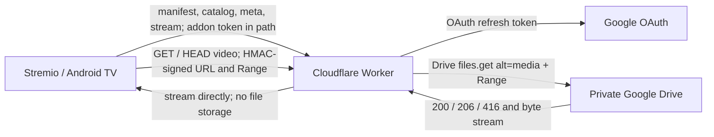

# DriveMio

DriveMio is a personal Stremio addon that streams **private** Google Drive video files through a Cloudflare Worker. Phase 1 keeps media metadata in a JSON file in the repository. A local sync command can generate that file from a Drive folder. The Worker does not scan Drive on each request. It does not include a database, multi-user authentication, or transcoding. Use it only for videos you have the right to access.

## Get started

You need Node.js 22.13+ or 24+, `make`, a Cloudflare account, and a Google Cloud project with the Drive API enabled. Put one downloadable MP4 in a **private** Google Drive folder; each video can be a file directly inside that folder. A separate folder per video is unnecessary. Follow [Google Cloud and OAuth refresh token](#google-cloud-and-oauth-refresh-token) once to obtain an OAuth client ID, client secret, and refresh token for the Google account that can access the folder.

```bash
git clone https://github.com/gemzruby/stremio-gdrive-addon.git
cd stremio-gdrive-addon
make install
cp .dev.vars.example .dev.vars
cp wrangler.example.jsonc wrangler.jsonc
```

Edit the two local files:

- In `.dev.vars`, set `GOOGLE_CLIENT_ID`, `GOOGLE_CLIENT_SECRET`, `GOOGLE_REFRESH_TOKEN`, and `DRIVE_FOLDER_ID` (the part after `/folders/` in the Drive URL). Generate separate values for `ADDON_TOKEN` and `STREAM_SIGNING_SECRET` with `openssl rand -hex 32` each. Leave its `PUBLIC_BASE_URL` as `http://localhost:8787` for local development.
- In `wrangler.jsonc`, set `name` to your Worker name and `vars.PUBLIC_BASE_URL` to `https://<worker-name>.<your-workers-subdomain>.workers.dev`. This is the public Worker origin, **not** a Google Drive URL.

Then run:

```bash
make preview-media
make generate-media
make login
make deploy
make manifest-url
```

Install the URL printed by `make manifest-url` through Nuvio's manual addon URL option. Keep that URL private: it contains your addon token. After adding or removing Drive videos, run `make generate-media && make deploy` again. The generated catalog is a snapshot; new files do not appear automatically. See [End-to-end test on Stremio/Nuvio on TV](#end-to-end-test-on-stremionuvio-on-tv) if you want to verify playback and seeking before installing on the TV.

## Architecture



`scripts/sync-media.mjs` can list video files in a Drive folder and generate the JSON catalog. The generated `src/data/media.json` is git-ignored; `src/data/media.example.json` is the publishable sample copied on first `npm install`. `src/index.ts` routes Stremio resources and video requests. `src/domain/media.ts` validates `src/data/media.json` when the module loads and exposes only public metadata in catalog and meta responses. `src/services/stream-signer.ts` signs `fileId:exp` with HMAC-SHA256. `google-token-provider.ts` exchanges a refresh token for an access token, and `google-drive-client.ts` calls the Drive API, retrying once after a 401 response. The Worker proxies only Drive file IDs listed in the media configuration. It passes `upstream.body` directly to the response without loading the whole file into memory or using the Cloudflare Cache API.

The addon token appears in the manifest and Stremio resource paths: `/<ADDON_TOKEN>/manifest.json`, `/<ADDON_TOKEN>/catalog/movie/my-drive.json`, `/<ADDON_TOKEN>/meta/movie/:id.json`, and `/<ADDON_TOKEN>/stream/movie/:id.json`. Video requests use `/video/:fileId?exp=...&sig=...` instead of the addon token. A signed URL expires at its `exp` Unix timestamp; the default lifetime is 3,600 seconds. This provides privacy for a single-user addon, **not multi-user authentication**. Tokens and URLs may appear in client history or proxy logs. Do not share the manifest or signed video URLs.

`GET /video` forwards one byte range in the form `bytes=start-end` or `bytes=start-` and preserves relevant media headers and 200, 206, or 416 status codes. For `HEAD /video`, the Worker requests `bytes=0-0` from Drive, immediately cancels the body, and returns the full file size in `Content-Length` when Drive supplies `Content-Range`. Multipart ranges, transcoding, and TV codec conversion are not supported. The Drive file must be a downloadable binary file supported by `files.get?alt=media`, not a Google Docs or Sheets document.

## Requirements

- Node.js 22.13+ (LTS) or 24+, with a compatible npm version.
- A Cloudflare account with Workers access, a Google account that can download the video files, and a Google Cloud project.
- Optional public HTTPS URLs for `poster` and `background`; new videos work without artwork. The `example.com` URLs in the sample data are placeholders.

## Common commands

After the one-time setup below, use `make help` to list available targets. The usual workflow when you add or remove a Drive video is:

```bash
make preview-media   # Check how many videos Drive returns; changes nothing.
make generate-media  # Regenerate the local, git-ignored media.json.
make check           # Typecheck, lint, and run tests.
make deploy          # Check again, upload the five secrets, and deploy the Worker.
make manifest-url    # Print the private manifest URL to install in Nuvio.
```

Set `DRIVE_FOLDER_ID` in `.dev.vars` once, using the ID from `https://drive.google.com/drive/folders/<FOLDER_ID>`. The media targets use that ID automatically. To override it for one run, use `make generate-media FOLDER_ID=<FOLDER_ID>`. Add `RECURSIVE=1` to include subfolders. `make install` installs npm dependencies; `make login` authorizes Wrangler with Cloudflare; `make dev` starts the local Worker; `make test` runs only tests. `make deploy` runs `make check` automatically.

`make deploy` reads the five Google/addon secrets from `.dev.vars`, passes them to Wrangler in a temporary file with restricted permissions, and removes that file afterward. It uploads code and secrets together, so it also works for the first deployment. The URL in your local `wrangler.jsonc` must be the correct production HTTPS origin. **Deployment makes the Worker reachable on the public Internet**, though addon and video routes still require their tokens. Commit `wrangler.example.jsonc`, but keep your personal `wrangler.jsonc`, `.dev.vars`, and generated media catalog out of Git.

## Local development and verification

Run `make dev` after completing the setup above to start the Worker at `http://localhost:8787`.

Set `PUBLIC_BASE_URL="http://localhost:8787"` in `.dev.vars`. Generate two independent random values of at least 32 bytes, for example by running `openssl rand -hex 32` twice: use one for `ADDON_TOKEN` and the other for `STREAM_SIGNING_SECRET`. Never commit `.dev.vars`; it is excluded by `.gitignore`.

Generate the catalog from a Drive folder as described below, or replace the sample item manually with a unique `id` beginning with `tam_`, `type: "movie"`, a name, description, year, optional HTTPS image URLs, MIME type, and the Google Drive file ID from its URL (`/file/d/<ID>/view`). Do not reuse an item ID or Drive file ID. Run typecheck and tests again after editing metadata. The placeholder item demonstrates the metadata API but cannot play a video.

Check the local API after replacing the token below with your own. Avoid storing token-bearing commands in shared shell history.

```bash
curl -i 'http://localhost:8787/<ADDON_TOKEN>/manifest.json'
curl -s 'http://localhost:8787/<ADDON_TOKEN>/catalog/movie/my-drive.json'
curl -s 'http://localhost:8787/<ADDON_TOKEN>/stream/movie/<MEDIA_ID>.json'
```

Copy `streams[0].url` from the stream response and test that signed URL:

```bash
curl -i -H 'Range: bytes=0-1023' '<SIGNED_URL>'
curl -I '<SIGNED_URL>'
```

For a real file that supports range requests, the first command should return `206`, `Content-Range: bytes 0-1023/<total>`, `Content-Length: 1024`, and `Accept-Ranges: bytes`. Local HTTP URLs are for testing; Stremio installation requires a public HTTPS deployment.

## Generate media.json from a Drive folder

After entering real Google OAuth credentials and `DRIVE_FOLDER_ID` in `.dev.vars`, run:

```bash
make preview-media
make generate-media
# Add RECURSIVE=1 to include videos in subfolders.
make check
```

The command uses the same refresh token as the Worker to call Google's [`files.list` API](https://developers.google.com/workspace/drive/api/reference/rest/v3/files/list). It follows all result pages, includes only files with a `video/*` MIME type, and writes a sorted `src/data/media.json`. It derives the item ID from the Drive file ID (`tam_<fileId>`), the title from the filename, the description from Drive metadata when available, and the year from the file's creation time. A zero-video result is an error and leaves the existing JSON untouched. The command prints counts, never credentials or Google response bodies.

Existing `poster` and `background` URLs for a file are preserved on subsequent syncs. New items omit artwork until you add public HTTPS image URLs manually. Private Drive `thumbnailLink` values are short lived and require authorization, so they are unsuitable as public poster URLs; see the [Drive file resource documentation](https://developers.google.com/workspace/drive/api/reference/rest/v3/files). Metadata without artwork can still appear in the catalog, but Nuvio's presentation may be less polished. The sync replaces entries that are no longer in the chosen folder. The generated `src/data/media.json` is excluded from Git, so your private filenames and Drive IDs are not published with the source. Review the generated catalog before deploying. Run the command and redeploy whenever the folder contents change. It is a local generation step, not continuous background synchronization.

## Google Cloud and OAuth refresh token

1. Create a Google Cloud project and enable the **Google Drive API**.
2. Configure the OAuth consent screen. For a personal app, add your Google account as a test user if required. An External app in **Testing** may receive refresh tokens that expire after seven days; see [Google's OAuth documentation](https://developers.google.com/identity/protocols/oauth2#expiration).
3. Create an OAuth client of type **Web application**. To obtain a refresh token manually, add `https://developers.google.com/oauthplayground` to its Authorized redirect URIs. In the [OAuth 2.0 Playground](https://developers.google.com/oauthplayground/), enable “Use your own OAuth credentials” and enter the client ID and secret. Request offline access (`access_type=offline`) and the practical minimum scope for existing personal Drive files: `https://www.googleapis.com/auth/drive.readonly`. The narrower `drive.file` scope generally covers files created by or explicitly opened/shared with the app, so it may not cover all existing personal files. Google may require verification for Drive scopes depending on the app's status.
4. Authorize with the account that owns or can download the files, exchange the authorization code, and save the **refresh token** in `.dev.vars` or a Wrangler secret. Keep the client secret and refresh token private. If Google does not return a refresh token, revoke the existing grant and repeat consent to request a new one.
5. Confirm that the file can be downloaded. The Worker cannot stream a file if downloads are restricted or Drive quota is exhausted. When retiring the app, revoke its access in [Google Account connections](https://myaccount.google.com/connections), delete the Cloudflare secrets, and rotate the addon tokens.

Google documents `alt=media` and byte ranges in its [Drive download guide](https://developers.google.com/workspace/drive/api/guides/manage-downloads), and the refresh-token flow in its [OAuth web-server guide](https://developers.google.com/identity/protocols/oauth2/web-server). Phase 1 does not require an OAuth callback page or login UI.

## Cloudflare deployment

Copy `wrangler.example.jsonc` to the Git-ignored `wrangler.jsonc`, then set `name` to your Worker name and `PUBLIC_BASE_URL` to its actual HTTPS origin, without a path or trailing slash; for example, `https://<worker-name>.<subdomain>.workers.dev`. This keeps your personal domain out of the published repository. `STREAM_URL_TTL_SECONDS` accepts an integer from 1 to 86,400 and defaults to 3,600. `PUBLIC_BASE_URL` is a regular variable; **never put secrets in `vars`**. Cloudflare's `secrets.required` checks secret names during development and deployment. See the [Wrangler configuration](https://developers.cloudflare.com/workers/wrangler/configuration/) and [Secrets](https://developers.cloudflare.com/workers/configuration/secrets/) documentation.

```bash
make login
make deploy
```

The deploy script reads the five secrets from `.dev.vars` without printing them. Do not place secret values in command arguments or chat. After deployment, open `https://<worker-domain>/<ADDON_TOKEN>/manifest.json`, check the catalog and stream responses, copy the signed video URL, and repeat `curl -i -H 'Range: bytes=0-1023' '<SIGNED_URL>'`. Install the manifest URL in Stremio, then verify the poster, title, description, playback, and seeking on an actual Android TV device. Production deployment and real-file playback checks require your Cloudflare account, secrets, and Drive file ID.

To rotate `ADDON_TOKEN`, update `.dev.vars` and run `make deploy`; the old manifest URL will stop working. Remove the old addon from Stremio and install the new URL from `make manifest-url`. Rotating `STREAM_SIGNING_SECRET` the same way invalidates existing signed video URLs; the client must request the stream resource again. If OAuth credentials are exposed, revoke and replace the refresh token and client secret. Do not log full URLs: the query contains a signature and the addon path contains a token.

## End-to-end test on Stremio/Nuvio on TV

Use one short MP4 file you own for the first test. H.264 video with AAC audio is a practical compatibility baseline for Android TV; the addon does not transcode files. Generate the catalog from your Drive folder or replace the sample Drive file ID, and make sure the Google account used for OAuth can download that file. A placeholder file ID cannot pass the playback test.

1. **Verify the addon API:** Deploy the Worker, open `https://<worker-domain>/<ADDON_TOKEN>/manifest.json` and confirm it returns JSON. Request the catalog, meta, and stream endpoints shown above. The catalog should contain your item, and the stream endpoint should return an HTTPS `streams[0].url` on your Worker domain. Neither catalog nor meta should expose the Drive file ID.
2. **Verify the video proxy:** Copy `streams[0].url` into the `curl` commands above before it expires. A range request for the first 1,024 bytes should return `206` with the expected `Content-Range` and `Content-Length`. A `HEAD` request should return `200` and the total file size. If this fails, fix Drive permissions, OAuth, the file ID, or `PUBLIC_BASE_URL` before testing the TV.
3. **Install on Nuvio TV:** In Nuvio's **Add-ons** screen, choose the manual URL install option and enter the complete HTTPS manifest URL, including `ADDON_TOKEN` and `/manifest.json`. Nuvio's [TV repository](https://github.com/NuvioMedia/NuvioTV) describes the app as using the Stremio addon ecosystem; its [addon API](https://github.com/NuvioMedia/NuvioTV/blob/dev/app/src/main/java/com/nuvio/tv/data/remote/api/AddonApi.kt) fetches manifest, catalog, meta, and stream URLs. Menu labels can vary by Nuvio version.
4. **Verify playback and seeking:** Find the **My Drive** catalog, open the video, select the **Google Drive** stream, and play it. Seek near the middle, then restart playback. Check that playback resumes and that the Worker receives further range requests rather than downloading the entire file first. Test on the actual TV device and player you plan to use.

If the addon does not install, check the manifest URL and HTTPS certificate. If the catalog is empty, check `src/data/media.json`, redeploy, and refresh the addon in Nuvio. If the item appears but the stream is absent, test the stream endpoint directly and check `PUBLIC_BASE_URL`. If `curl` returns `403`, obtain a fresh signed URL or check the signing secret; if it returns `404` or `502`, check the Drive file ID, file permissions, OAuth credentials, and Drive API availability. If `curl` returns `206` but Nuvio cannot play, try the baseline MP4 and another Nuvio player/decoder setting; that points to player or codec compatibility rather than the addon API. Do not send signed URLs or secret values when sharing diagnostics.

## API behavior and limitations

An unknown meta ID returns `{ "meta": null }`; an unknown stream ID returns `{ "streams": [] }`; unknown routes and addon tokens return 404. Errors use `{ "error": { "code": "..." } }` rather than exposing raw Google responses. Media responses include `Cache-Control: private, no-store` and CORS headers for Stremio. Google credentials stay in the Worker and are never sent to Stremio.

Playback depends on the codecs and containers supported by the Android TV device. Large files and seeking depend on Drive range support and Google's quotas and rate limits. Cloudflare Workers also have plan-dependent resource, request, and bandwidth limits. This addon has been verified with a private Google Drive MP4 on Nuvio TV, but other codecs, devices, and large files may behave differently. Before publishing the repository, review its Git history and make sure it contains no `.dev.vars` file, generated `src/data/media.json`, real tokens, or signed URLs.
