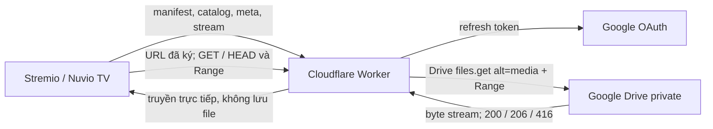

# DriveMio

DriveMio là addon Stremio cá nhân giúp phát video **riêng tư** trên Google Drive qua Cloudflare Worker, dùng được với các ứng dụng tương thích Stremio như Nuvio TV. Danh sách video được tạo từ một thư mục Drive bằng lệnh chạy trên máy của bạn. Worker không quét Drive mỗi khi có yêu cầu. Dự án dành cho một người dùng, không có tài khoản nhiều người và không chuyển mã video. Chỉ sử dụng với video bạn có quyền truy cập.

## Bắt đầu nhanh

Bạn cần Node.js 22.13+ hoặc 24+, `make`, tài khoản Cloudflare và dự án Google Cloud đã bật Drive API. Hãy tải một tệp MP4 có thể tải xuống vào một thư mục Drive **private**. Có thể đặt nhiều video trực tiếp trong cùng thư mục; không cần tạo thư mục riêng cho từng video. Làm theo mục [Google Cloud và refresh token](#google-cloud-và-refresh-token) một lần để lấy OAuth client ID, client secret và refresh token của tài khoản Google có quyền xem thư mục.

```bash
git clone https://github.com/gemzruby/stremio-gdrive-addon.git
cd stremio-gdrive-addon
make install
cp .dev.vars.example .dev.vars
cp wrangler.example.jsonc wrangler.jsonc
```

Chỉnh hai tệp cấu hình vừa tạo:

- Trong `.dev.vars`, điền `GOOGLE_CLIENT_ID`, `GOOGLE_CLIENT_SECRET`, `GOOGLE_REFRESH_TOKEN` và `DRIVE_FOLDER_ID` (phần sau `/folders/` trong URL thư mục Drive). Tạo hai giá trị độc lập cho `ADDON_TOKEN` và `STREAM_SIGNING_SECRET` bằng cách chạy `openssl rand -hex 32` hai lần. Giữ `PUBLIC_BASE_URL` là `http://localhost:8787` để chạy local.
- Trong `wrangler.jsonc`, đặt `name` thành tên Worker của bạn và `vars.PUBLIC_BASE_URL` thành `https://<worker-name>.<your-workers-subdomain>.workers.dev`. Đây là địa chỉ Worker công khai, **không phải** URL Google Drive.

Sau đó chạy:

```bash
make preview-media
make generate-media
make login
make deploy
make manifest-url
```

Cài URL do `make manifest-url` in ra qua mục thêm addon bằng URL trong Nuvio. Giữ kín URL này vì nó chứa addon token. Khi thêm hoặc xóa video trên Drive, chạy lại `make generate-media && make deploy`. Danh sách video là bản chụp tại thời điểm tạo, không tự cập nhật. Xem mục [Kiểm tra trên TV](#kiểm-tra-trên-stremionuvio-tv) để kiểm tra phát và tua video.

## Kiến trúc



`scripts/sync-media.mjs` liệt kê video trong thư mục Drive và tạo `src/data/media.json`. Tệp này được Git bỏ qua; `src/data/media.example.json` là mẫu công khai và được sao chép khi chạy `make install` lần đầu. `src/index.ts` xử lý các endpoint Stremio và video. `src/domain/media.ts` kiểm tra dữ liệu media và chỉ đưa metadata công khai vào catalog/meta. `src/services/stream-signer.ts` ký `fileId:exp` bằng HMAC-SHA256. `google-token-provider.ts` dùng refresh token để lấy access token; `google-drive-client.ts` gọi Drive API và thử lại một lần sau lỗi 401. Worker chỉ proxy các Drive file ID có trong catalog. Nội dung video được truyền trực tiếp từ luồng phản hồi của Drive, không tải toàn bộ vào bộ nhớ và không dùng Cloudflare Cache API.

Addon token nằm trong đường dẫn `/<ADDON_TOKEN>/manifest.json`, `/<ADDON_TOKEN>/catalog/movie/my-drive.json`, `/<ADDON_TOKEN>/meta/movie/:id.json` và `/<ADDON_TOKEN>/stream/movie/:id.json`. Video dùng URL `/video/:fileId?exp=...&sig=...` có chữ ký, hết hạn sau 3.600 giây theo mặc định. Cơ chế này bảo vệ addon cá nhân, **không phải hệ thống xác thực nhiều người dùng**. Token và URL có thể xuất hiện trong lịch sử của client hoặc log proxy; không chia sẻ manifest URL hay URL video đã ký.

`GET /video` chuyển tiếp một byte range dạng `bytes=start-end` hoặc `bytes=start-`, giữ các header media và mã trạng thái 200, 206 hoặc 416. Với `HEAD /video`, Worker yêu cầu `bytes=0-0` từ Drive, hủy phần body ngay và trả kích thước đầy đủ qua `Content-Length` nếu Drive cung cấp `Content-Range`. Không hỗ trợ nhiều range trong cùng yêu cầu, chuyển mã hay đổi codec cho TV. Tệp Drive phải là tệp nhị phân tải được qua `files.get?alt=media`, không phải tài liệu Google Docs hoặc Sheets.

## Yêu cầu

- Node.js 22.13+ (LTS) hoặc 24+, với npm tương thích.
- Tài khoản Cloudflare có quyền dùng Workers; tài khoản Google tải được video; dự án Google Cloud.
- URL HTTPS công khai cho `poster` và `background` nếu muốn có ảnh. Ảnh là tùy chọn; các URL `example.com` trong dữ liệu mẫu chỉ là placeholder.

## Các lệnh thường dùng

```bash
make help            # Xem tất cả lệnh
make install         # Cài npm dependencies
make preview-media   # Đếm video trên Drive, không sửa media.json
make generate-media  # Tạo lại media.json từ thư mục Drive
make check           # Typecheck, lint và test
make test            # Chỉ chạy test
make dev             # Chạy Worker trên máy
make login           # Đăng nhập Cloudflare qua Wrangler
make deploy          # Kiểm tra rồi deploy mã và secrets
make manifest-url    # In URL manifest riêng tư để cài trên Nuvio
```

`DRIVE_FOLDER_ID` được đọc từ `.dev.vars`. Có thể ghi đè cho một lần chạy bằng `make generate-media FOLDER_ID=<FOLDER_ID>`; thêm `RECURSIVE=1` để quét cả thư mục con. `make deploy` tự chạy `make check`. Lệnh deploy lấy năm secret từ `.dev.vars`, truyền cho Wrangler qua tệp tạm có quyền truy cập hạn chế rồi xóa tệp đó. Mã và secrets được tải lên cùng nhau, kể cả lần deploy đầu tiên. Worker sẽ truy cập được từ Internet, nhưng các endpoint addon và video vẫn cần token hợp lệ. Chỉ đưa `wrangler.example.jsonc` lên Git; giữ `wrangler.jsonc` cá nhân, `.dev.vars` và catalog đã tạo ở ngoài Git.

## Chạy và kiểm tra trên máy

Sau khi hoàn tất cấu hình, chạy `make dev`. Worker sẽ ở `http://localhost:8787`. Thay các placeholder bên dưới bằng token và ID media của bạn; tránh lưu lệnh chứa token trong shell history dùng chung.

```bash
curl -i 'http://localhost:8787/<ADDON_TOKEN>/manifest.json'
curl -s 'http://localhost:8787/<ADDON_TOKEN>/catalog/movie/my-drive.json'
curl -s 'http://localhost:8787/<ADDON_TOKEN>/stream/movie/<MEDIA_ID>.json'
```

Lấy `streams[0].url` từ phản hồi stream và kiểm tra URL đã ký:

```bash
curl -i -H 'Range: bytes=0-1023' '<SIGNED_URL>'
curl -I '<SIGNED_URL>'
```

Với tệp hỗ trợ Range, lệnh đầu trả 206, `Content-Range: bytes 0-1023/<total>`, `Content-Length: 1024` và `Accept-Ranges: bytes`. URL HTTP local chỉ dùng để kiểm tra; cài addon vào Stremio/Nuvio cần triển khai HTTPS công khai.

## Tạo media.json từ thư mục Drive

Sau khi điền OAuth credentials và `DRIVE_FOLDER_ID` thật vào `.dev.vars`:

```bash
make preview-media
make generate-media
# Thêm RECURSIVE=1 nếu muốn quét thư mục con.
make check
```

Lệnh dùng cùng refresh token với Worker để gọi [Drive files.list API](https://developers.google.com/workspace/drive/api/reference/rest/v3/files/list). Nó đọc tất cả trang kết quả, chỉ lấy tệp có MIME `video/*` và ghi `src/data/media.json` theo thứ tự tên. ID item có dạng `tam_<fileId>`; tên lấy từ tên tệp, mô tả lấy từ metadata Drive nếu có, năm lấy từ thời điểm tạo tệp. Nếu không tìm thấy video, lệnh báo lỗi và giữ nguyên JSON cũ. Lệnh chỉ in số lượng, không in credentials hoặc nội dung phản hồi Google.

`poster` và `background` đã thêm cho một tệp sẽ được giữ khi đồng bộ lại. Item mới không có ảnh cho đến khi bạn tự thêm URL ảnh HTTPS công khai. `thumbnailLink` riêng tư của Drive có thời hạn ngắn và cần quyền truy cập, nên không thích hợp làm URL poster công khai; xem [tài liệu Drive file resource](https://developers.google.com/workspace/drive/api/reference/rest/v3/files). Media không có ảnh vẫn có thể xuất hiện trong catalog, nhưng Nuvio có thể hiển thị kém đẹp hơn. Việc đồng bộ sẽ xóa các mục không còn nằm trong thư mục được chọn. `src/data/media.json` bị Git bỏ qua để tên tệp và Drive ID riêng tư không được công bố cùng mã nguồn. Xem lại catalog trước khi deploy. Sau khi nội dung thư mục đổi, cần tạo lại media và deploy; hệ thống không đồng bộ nền.

## Google Cloud và refresh token

1. Tạo dự án Google Cloud và bật **Google Drive API**.
2. Cấu hình OAuth consent screen. Với ứng dụng cá nhân, thêm tài khoản Google của bạn vào danh sách test user nếu được yêu cầu. Ứng dụng External ở trạng thái **Testing** có thể nhận refresh token hết hạn sau bảy ngày; xem [tài liệu OAuth của Google](https://developers.google.com/identity/protocols/oauth2#expiration).
3. Tạo OAuth client loại **Web application**. Để tự lấy refresh token, thêm `https://developers.google.com/oauthplayground` vào Authorized redirect URIs. Trong [OAuth 2.0 Playground](https://developers.google.com/oauthplayground/), bật “Use your own OAuth credentials” rồi nhập client ID và secret. Yêu cầu offline access (`access_type=offline`) và scope tối thiểu thực tế cho các tệp Drive cá nhân có sẵn: `https://www.googleapis.com/auth/drive.readonly`. Scope hẹp hơn `drive.file` thường chỉ áp dụng cho tệp do ứng dụng tạo hoặc được mở/chia sẻ rõ ràng với ứng dụng, nên có thể không thấy hết tệp cá nhân cũ. Google có thể yêu cầu xác minh ứng dụng tùy trạng thái và scope.
4. Cho phép truy cập bằng tài khoản sở hữu hoặc tải được video, đổi authorization code lấy token, rồi lưu **refresh token** vào `.dev.vars`. Giữ kín client secret và refresh token. Nếu Google không trả refresh token, thu hồi quyền cấp trước đó và lặp lại bước đồng ý với offline access.
5. Xác nhận có thể tải tệp. Worker không phát được tệp bị hạn chế tải xuống hoặc khi vượt quota Drive. Khi ngừng dùng ứng dụng, thu hồi quyền tại [Google Account connections](https://myaccount.google.com/connections), xóa Cloudflare secrets và đổi addon tokens.

Google giải thích `alt=media` và byte ranges trong [hướng dẫn tải tệp Drive](https://developers.google.com/workspace/drive/api/guides/manage-downloads), và luồng refresh token trong [hướng dẫn OAuth web-server](https://developers.google.com/identity/protocols/oauth2/web-server). Giai đoạn hiện tại không cần trang callback OAuth hay giao diện đăng nhập.

## Triển khai Cloudflare

Sao chép `wrangler.example.jsonc` thành `wrangler.jsonc` (tệp này bị Git bỏ qua). Đặt `name` thành tên Worker và `PUBLIC_BASE_URL` thành HTTPS origin thật, không có path hoặc dấu `/` cuối; ví dụ `https://<worker-name>.<subdomain>.workers.dev`. Như vậy subdomain cá nhân không xuất hiện trong repo công khai. `STREAM_URL_TTL_SECONDS` nhận số nguyên từ 1 đến 86.400, mặc định 3.600. `PUBLIC_BASE_URL` là biến thông thường; **không đặt secret trong `vars`**. Cloudflare dùng `secrets.required` để kiểm tra tên secrets khi chạy và deploy. Xem [cấu hình Wrangler](https://developers.cloudflare.com/workers/wrangler/configuration/) và [Cloudflare Secrets](https://developers.cloudflare.com/workers/configuration/secrets/).

```bash
make login
make deploy
```

Script deploy đọc năm secret từ `.dev.vars` mà không in chúng ra. Không đưa secret vào đối số dòng lệnh hay chat. Sau khi deploy, mở `https://<worker-domain>/<ADDON_TOKEN>/manifest.json` để xem JSON; kiểm tra catalog và stream, lấy URL video đã ký rồi thử `curl -i -H 'Range: bytes=0-1023' '<SIGNED_URL>'`. Cài manifest URL vào Stremio/Nuvio và kiểm tra ảnh, tiêu đề, mô tả, phát và tua trên Android TV thật. Việc deploy và thử video thật cần tài khoản Cloudflare, secrets và Drive file ID của bạn.

Để đổi `ADDON_TOKEN`, sửa `.dev.vars` rồi chạy `make deploy`; manifest URL cũ sẽ hết hiệu lực. Xóa addon cũ khỏi Stremio/Nuvio và cài URL mới từ `make manifest-url`. Đổi `STREAM_SIGNING_SECRET` cũng làm các URL video đã ký trước đó mất hiệu lực; client phải yêu cầu lại stream resource. Nếu OAuth credentials bị lộ, thu hồi và thay refresh token cùng client secret. Không ghi log đầy đủ URL: query chứa chữ ký và đường dẫn addon chứa token.

## Kiểm tra trên Stremio/Nuvio TV

Dùng một tệp MP4 ngắn mà bạn sở hữu để thử đầu tiên. Video H.264 với âm thanh AAC là lựa chọn thực tế cho Android TV; addon không chuyển mã. Tạo catalog từ thư mục Drive hoặc thay Drive file ID trong dữ liệu mẫu; bảo đảm tài khoản OAuth tải được tệp. File ID placeholder không thể phát video.

1. **Kiểm tra addon API:** Deploy Worker, mở `https://<worker-domain>/<ADDON_TOKEN>/manifest.json` và xác nhận nhận được JSON. Gọi các endpoint catalog, meta, stream đã nêu ở trên. Catalog phải chứa video; stream phải có `streams[0].url` HTTPS trên domain Worker. Catalog và meta không được lộ Drive file ID.
2. **Kiểm tra proxy video:** Lấy `streams[0].url` và dùng các lệnh `curl` ở trên trước khi URL hết hạn. Yêu cầu 1.024 byte đầu phải trả 206 với `Content-Range` và `Content-Length` đúng. Yêu cầu `HEAD` phải trả 200 cùng kích thước toàn tệp. Nếu bước này lỗi, kiểm tra quyền Drive, OAuth, file ID và `PUBLIC_BASE_URL` trước khi thử trên TV.
3. **Cài trên Nuvio TV:** Trong màn hình **Add-ons** của Nuvio, chọn cài thủ công bằng URL và nhập đầy đủ manifest URL HTTPS, gồm `ADDON_TOKEN` và `/manifest.json`. [Repository Nuvio TV](https://github.com/NuvioMedia/NuvioTV) cho biết ứng dụng dùng hệ sinh thái addon Stremio; [addon API của Nuvio](https://github.com/NuvioMedia/NuvioTV/blob/dev/app/src/main/java/com/nuvio/tv/data/remote/api/AddonApi.kt) gọi manifest, catalog, meta và stream. Tên menu có thể khác tùy phiên bản.
4. **Thử phát và tua:** Tìm catalog **My Drive**, mở video, chọn stream **Google Drive** rồi phát. Tua tới gần giữa video, sau đó phát lại từ đầu. Kiểm tra Worker nhận thêm yêu cầu Range thay vì tải toàn bộ tệp trước. Thử trên chính TV và trình phát bạn định dùng.

Nếu addon không cài được, kiểm tra manifest URL và chứng chỉ HTTPS. Nếu catalog trống, kiểm tra `src/data/media.json`, deploy lại và làm mới addon trong Nuvio. Nếu có item nhưng không có stream, gọi trực tiếp stream endpoint và kiểm tra `PUBLIC_BASE_URL`. Nếu yêu cầu video trả `502` với `GOOGLE_AUTH_FAILED`, thử refresh token bằng `make preview-media`; lỗi `invalid_grant` của Google nghĩa là token không còn dùng được. Lấy refresh token mới bằng OAuth client credentials của chính bạn trong OAuth Playground, cập nhật `.dev.vars`, rồi chạy `make preview-media && make deploy`. Không cần tạo lại media nếu nội dung thư mục không đổi. OAuth Playground có thể thu hồi token sau 24 giờ nếu không dùng credentials của ứng dụng riêng; ứng dụng OAuth External ở trạng thái Testing có thể cấp refresh token hết hạn sau bảy ngày. Đây là những nguyên nhân có thể xảy ra, không phải kết luận về token cụ thể. Nếu `curl` trả 403, lấy URL đã ký mới hoặc kiểm tra signing secret; với 404 hoặc lỗi 502 khác, kiểm tra Drive file ID, quyền tệp, OAuth credentials và Drive API. Nếu `curl` trả 206 nhưng Nuvio không phát được, thử MP4 chuẩn H.264/AAC và đổi cài đặt trình phát hoặc decoder của Nuvio; vấn đề có thể nằm ở codec hoặc trình phát. Không chia sẻ URL đã ký hay secret khi gửi thông tin chẩn đoán.

## Hành vi API và giới hạn

Meta ID không tồn tại trả `{"meta": null}`; stream ID không tồn tại trả `{"streams": []}`; route hoặc addon token sai trả 404. Lỗi có dạng `{"error": {"code": "..."}}`, không trả nguyên phản hồi Google. Phản hồi media dùng `Cache-Control: private, no-store` và CORS headers cho Stremio. Google credentials ở trong Worker và không được gửi cho Stremio.

Khả năng phát phụ thuộc codec và container mà Android TV hỗ trợ. Tệp lớn và thao tác tua phụ thuộc hỗ trợ Range, quota và giới hạn tốc độ của Google Drive. Cloudflare Workers cũng có giới hạn tài nguyên, request và băng thông tùy gói. Addon đã được thử với MP4 private trên Google Drive và Nuvio TV, nhưng codec, thiết bị và tệp lớn khác có thể hoạt động khác. Trước khi công bố repo, hãy xem lại lịch sử Git để bảo đảm không có `.dev.vars`, `src/data/media.json` thật, token hoặc URL video đã ký.
